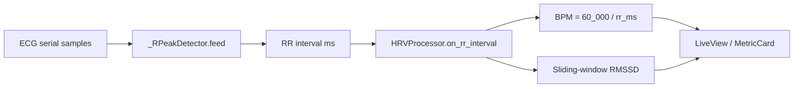

# Heart rate & HRV pipeline — analysis (BPM jumps)

This document traces how BioTrace turns ECG samples into BPM and RMSSD, and explains why the displayed heart rate can jump sharply between beats. It is based on the current implementation in `app/hardware/pico_ecg_sensor.py`, `app/processing/hrv_processor.py`, and `app/utils/config.py`.

## 1. End-to-end data flow

1. **`_RPeakDetector`** (`pico_ecg_sensor.py`): DC baseline removal (EMA), adaptive threshold (`PICO_RPEAK_THRESHOLD_FACTOR ×` max AC in window), peak acceptance on the **falling edge** of a threshold crossing, with a **refractory period** between accepted peaks.
2. **`HRVProcessor`** (`hrv_processor.py`): Appends each accepted RR to a deque, evicts by timestamp for RMSSD, computes **`bpm = 60_000.0 / rr_ms`** for **that single interval only** (beat-to-beat instantaneous rate).
3. **Session / UI**: `SessionManager._forward_bpm` forwards that BPM to the live view; `MetricCard` animates between numeric values; the camera overlay BPM label shows the raw rounded value (`live_view.py`).

There is **no** separate “display heart rate” smoother (e.g. median over last *n* beats or low-pass filter) in the processing layer—only optional animation in the metric card.

## 2. Why BPM jumps: expected vs pathological

### 2.1 Expected variability (not necessarily a bug)

- **Definition**: BPM is **instantaneous**: one RR interval fully determines the number. Normal respiratory sinus arrhythmia and autonomic variation change RR by tens of milliseconds beat-to-beat. Example: 800 ms → 75 BPM vs 880 ms → 68 BPM is an 7 BPM swing from a **10%** RR change—visible on a numeric display even when the signal is clean.
- **RMSSD** is designed to quantify that variability; a “smooth” HR for UX is a **product choice**, not something the current math wrongfully omits—it was never implemented as a moving average HR.

### 2.2 Pathological jumps (detector / pipeline artefacts)

These produce **large** swings (often ±20–40 BPM or more) and usually correlate with odd RR lengths or stable wrong rates:

| Cause | Mechanism | Typical symptom |
|--------|-----------|-----------------|
| **Extra detection** (noise, T-wave, motion) | Short false RR | **Spike** in BPM |
| **Missed R peak** | Long RR until next detection | **Drop** in BPM |
| **T-wave counted as R** (historical) | Refractory too short vs QT | Stable **~150 BPM**, RMSSD **≈ 0** (documented in `tests/test_processors.py`) |
| **Refractory vs true HR** | Min spacing `PICO_RPEAK_REFRACTORY_SAMPLES` = 90 @ 150 Hz → **600 ms** minimum RR | True HR **> ~100 BPM** implies R–R **< 600 ms**; detector may **reject** peaks, merging intervals → alternating long/short RR → **sawtooth BPM** |

The codebase explicitly tied the old **400 ms** refractory to a **~150 BPM / near-zero RMSSD** failure mode and increased refractory to **90 samples (600 ms)** to keep T-waves out. That trade-off is **correct for T-wave suppression** but **caps** credible instantaneous HR from this detector at roughly **100 BPM** unless refractory or sample rate is retuned.

### 2.3 Plausibility filter asymmetry

- `HRV_MIN_RR_MS` (**500 ms**) drops intervals shorter than 500 ms (**> 120 BPM**) before they enter the RMSSD window or BPM emission (`hrv_processor.py`).
- **Comment mismatch**: `HRVProcessor` docstring says intervals below the minimum imply heart rates “above **~180** BPM”; **500 ms corresponds to 120 BPM**, not 180. The **config** comment (“500 ms = 120 BPM”) is consistent; the processor docstring is misleading.

So **very short** spurious intervals are suppressed, but **long** bogus intervals (missed beat) still pass and **depress BPM** in one shot.

## 3. Algorithm details that affect stability

### 3.1 R-peak timing

- Peaks are tied to the **rising-edge** sample index when the signal crosses the threshold; the interval is **sample_since_last_peak / sample_rate**. Jitter in threshold crossing (noise, baseline wander) adds **±1–2 samples** (≈ **7–13 ms** at 150 Hz), which maps to visible BPM flicker at typical HR.

### 3.2 Timestamps

- RR events are timestamped with **`time.time()`** when the interval is emitted (`_SerialWorker`), not the interpolated sample time of the R wave. This affects **alignment** with other streams, not the BPM formula itself (BPM uses RR duration from sample indices, not wall clock).

### 3.3 Adaptive threshold

- Threshold = `PICO_RPEAK_THRESHOLD_FACTOR` × max of AC samples in a **1 s** window (`PICO_RPEAK_AMPLITUDE_WINDOW` = 150). If amplitude collapses (bad contact) or noise dominates, thresholding can become unstable and **miss or duplicate** peaks.

## 4. Summary: is there a “mistake”?

| Area | Assessment |
|------|------------|
| **`bpm = 60000 / rr_ms`** | Mathematically correct for **instantaneous** HR from one interval. |
| **Large BPM jumps with clean physiology** | Often **expected** without smoothing; **RMSSD** is the right metric for variability. |
| **Jumps with implausible RR** | Points to **R-detection** (extra/missed peaks) or **refractory vs actual HR**, not division error in `HRVProcessor`. |
| **Doc / comment bug** | `HRVProcessor` docstring incorrectly cites “~180 BPM” for the 500 ms floor; should say **120 BPM**. |
| **Product gap** | No **median/mean HR over N beats** or **outlier rejection on RR** for display; camera overlay shows **raw** BPM. |

## 5. Recommendations (if jumps are unacceptable in the UI)

1. **Display HR**: compute e.g. **median or trimmed mean** of the last 5–15 RR intervals (or a **low-pass** on BPM), while keeping beat-to-beat RR for HRV storage.
2. **RR sanity gate**: reject or interpolate intervals that deviate > **20–30%** from the previous interval (with care during arrhythmia).
3. **HR above ~100 BPM**: revisit **`PICO_RPEAK_REFRACTORY_SAMPLES`** vs clinical max HR and firmware sample rate; may need a **shorter** refractory **only if** T-wave rejection stays robust (e.g. different detector path).
4. **Stronger R detection**: consider bandpass + Pan–Tompkins (or a maintained library) if hardware noise is high; the current method is lightweight but sensitive to morphology changes.

---

*Generated as part of a code review of the heart rate path; file names refer to the BioTrace repository layout.*
